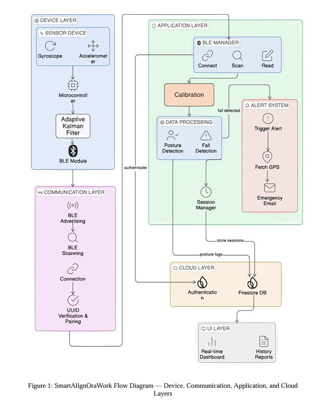

# 🚀 SmartAlignOra

### Intelligent Wearable System for Real-Time Posture Monitoring and Fall Detection

---

## 📌 Overview

**SmartAlignOra** is a wearable embedded system that combines **IMU-based sensing, embedded signal processing, Machine Learning, Bluetooth Low Energy, and Android** to monitor posture and detect falls in real time.

The system uses an **ESP32-C3 + MPU6050** wearable device to capture motion data, process it using an **adaptive Kalman filter**, and transmit sensor data to an Android application via **BLE**.

The Android application performs **on-device posture classification and fall detection** using Random Forest models deployed with **ONNX Runtime**.

---

## 🎯 Key Features

- 🧍 Real-time **GOOD / BAD posture classification**
- 🚨 ML-based **fall detection**
- 📡 50 Hz **BLE sensor data streaming**
- 🎯 Subject-specific posture calibration
- 📳 Multi-pattern vibration feedback
- 📍 GPS-based emergency alert after confirmed fall
- ☁️ Firebase-based session and posture history
- 📱 Real-time Android monitoring dashboard

---

## ⚙️ Hardware

### 🔹 Wearable Device

- **ESP32-C3 SuperMini**
- **MPU6050 6-axis IMU**
- Vibration motor with **2N2222 driver**
- Custom **28 × 36 mm double-sided PCB**
- **TP4056 Type-C** battery charging
- **3.3V LDO regulation**
- Li-ion rechargeable battery

### 🔹 Embedded Processing

The ESP32-C3 performs:

- IMU acquisition at **50 Hz**
- Adaptive **Kalman filtering**
- Personalized pitch/roll calibration
- Posture threshold evaluation
- BLE data transmission
- PWM-based vibration control

---

## 📡 Communication

Sensor data is transmitted from the wearable to the Android application using **Bluetooth Low Energy (BLE)**.

- Sampling rate: **50 Hz**
- Binary packet size: **20 bytes**
- BLE GATT-based communication
- Bidirectional communication for calibration and vibration control

---

## 🧠 Machine Learning

SmartAlignOra uses **two independent on-device ML pipelines**:

### 🧍 Posture Classification

- Input: IMU time-series data
- Window: **20 samples (~4 sec)**
- Features:
  - Mean
  - Standard deviation
  - Min / Max
  - Range
  - Slope
  - Percent high
- Model: **Random Forest**
- Deployment: **ONNX + ONNX Runtime**
- Accuracy: **94%**

### 🚨 Fall Detection

- Uses accelerometer, gyroscope, orientation and acceleration magnitude
- Window: **75 samples (~1.5 sec)**
- Model: **Random Forest**
- Deployment: **ONNX + ONNX Runtime**
- Accuracy: **97%**

Both models run **directly on the Android device without cloud-based inference**.

---

## 📱 Android Application

Built using **Kotlin**, the application provides:

- BLE device connection
- User calibration
- Real-time posture monitoring
- GOOD / BAD posture status
- 3D posture visualization
- Vibration configuration
- Fall detection and emergency alerts
- Session history and posture analytics

---

## ☁️ Firebase

**Firebase Authentication** and **Cloud Firestore** are used for:

- User authentication
- Session storage
- Posture data storage
- Historical posture analysis

---

## 🏗️ System Architecture



**Wearable Device → BLE → Android App → ML Inference → Alerts & Analytics**

---

## 📁 Project Structure

```text
SmartAlignOra/
│
├── hardware/
│   └── Hardware_Code/
│
├── software/
│   ├── Application/
│   ├── Machine-Learning/
│   └── frontend/
│
└── README.md
```

🌿 Branches
- main → Main software project
- hardware → ESP32-C3 firmware
- Application → Android application
- Machine-Learning → ML training and models
- frontend → Frontend-related development
  
📊 Validation
- 94% posture classification accuracy
- 97% fall detection accuracy
- 50 Hz continuous BLE streaming
- 30-minute BLE test without packet loss under controlled testing
- Adaptive Kalman filter improves responsiveness during dynamic motion
  
🛠️ Tech Stack
Hardware: ESP32-C3, MPU6050, Custom PCB, Vibration Motor
Embedded: C/C++, FreeRTOS, I2C, PWM, BLE
Mobile: Kotlin, Android
Machine Learning: Python, Scikit-learn, Random Forest, ONNX, ONNX Runtime
Cloud: Firebase Authentication, Cloud Firestore
Tools: Git, GitHub, Arduino IDE, KiCad

🎥 Demo
Demo videos demonstrating the wearable hardware, posture monitoring, and fall detection are available in the repository.

👥 Team
SmartAlignOra was developed as a collaborative academic project by:
- Kaushik Virendra Titre
- Tanay Sham Raundale
- Atharva Sunilrao Wankhade
- Hittanshi Dashrath Tikle
Pune Institute of Computer Technology (PICT)
